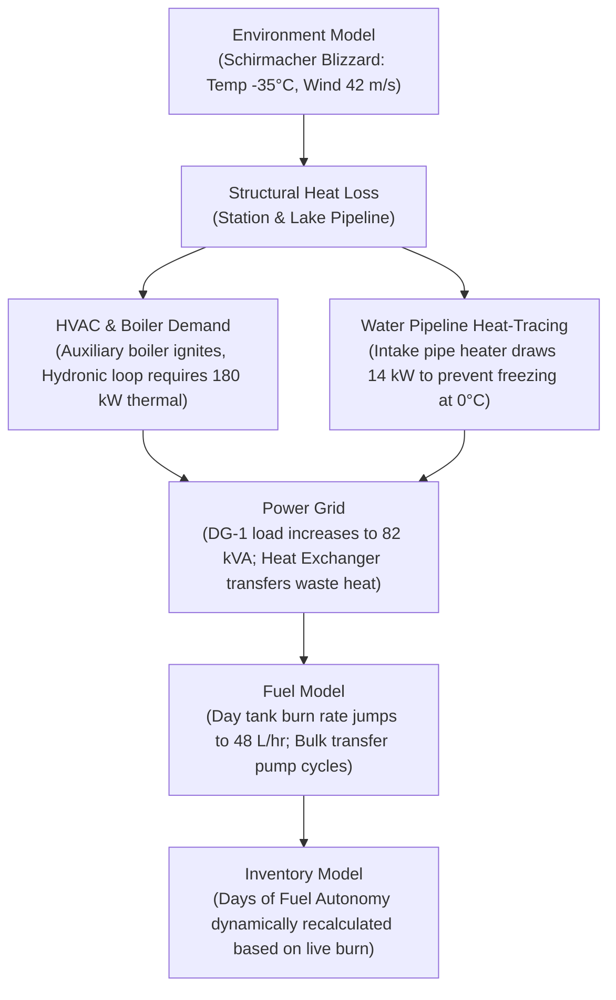

# Maitri Station Digital Twin Architecture & Component Breakdown

## 1. Overview & Station Context
**Maitri Station** is India's second permanent Antarctic research station, commissioned in 1989 and located in the rocky, ice-free **Schirmacher Oasis**, Queen Maud Land, East Antarctica (Coordinates: **70°45′58″S, 11°44′09″E**, Elevation: 117 m).

Unlike the coastal promontory of Bharati Station (which uses seawater reverse osmosis desalination and modern marine-grade composite construction), Maitri operates in a unique continental oasis environment beside **Lake Priyadarshini** (a glacial freshwater lake) with a heavy-duty steel superstructure on stilts, 100 kVA polar diesel generators with hydronic heat recovery, and an iconic **250-meter electrically heat-traced overland water pipeline**.

Following our established architectural principle:
> **We will NOT build 28 isolated dummy scripts.**
> Instead, we construct **10 interconnected physics macro-models** managed by a central **Interdependency Engine**.

---

## 2. System Breakdown (28 Physical Assets $\rightarrow$ 10 Interconnected Macro-Models)

| Simulator Model | Components Covered | Internal Assets/Units Included |
| :--- | :---: | :--- |
| **1. Environment Model** | 1 | Schirmacher Oasis meteorology, rock thermal inertia, solar geometry, katabatic winds |
| **2. Power Grid Model** | 5 | DG-1, DG-2, DG-3 (100 kVA each), 25 kW Solar PV array, Station Switchboard/UPS |
| **3. Heating / HVAC Model** | 3 | Central hydronic loop, Auxiliary oil-fired boiler, AHUs & Radiator distribution |
| **4. Water Supply Model** | 4 | Lake Priyadarshini intake, 250m heat-traced pipeline, Sand/UV filtration, 20,000L Potable tanks |
| **5. Fuel Management Model** | 3 | Outdoor bulk tank farm (165,000 L), Duplex transfer pumps + heat-tracing, 2,500 L Day tank |
| **6. Wastewater Model** | 3 | Biological Sewage Treatment Plant (STP), Aeration chamber, Incinerator toilets |
| **7. Communication Model** | 3 | GSAT-7A / VSAT satcom earth terminal, HF/VHF radio network, Novo Runway / Bharati trunk |
| **8. Vehicle Fleet Model** | 2 | PistenBully 300 Polar groomers, Manitou crane, Snowmobiles, 230V Engine block heaters |
| **9. Inventory & Spares Model** | 3 | Food & dry rations, Polar medical supplies, Critical generator/pump spare parts |
| **10. Human & Habitat Model** | 1 | Winter-over team (25 crew) / Summer camp (65 crew), Metabolic consumption, Cold stress |

---

## 3. Detailed Component Capabilities & Telemetry Specifications

| #  | Unit / System | Physics Fidelity | Primary Telemetry Parameters Simulated |
| -- | --- | --- | --- |
| 1  | ⚡ **DG-1 (100 kVA)** | ✅ Full Physics | RPM, kW load, power factor, fuel flow (L/hr), rail pressure, boost pressure, EGT (°C), jacket coolant temp, oil pressure, vibration (mm/s), runtime hours |
| 2  | ⚡ **DG-2 (100 kVA)** | ✅ Full Physics | Identical physics & sensor array as DG-1 (Duty / Standby rotation) |
| 3  | ⚡ **DG-3 (100 kVA)** | ✅ Full Physics | Identical physics & sensor array as DG-1 (Standby / Overhaul rotation) |
| 4  | ☀️ **Solar PV Array (25 kWp)** | ✅ Mathematical | Incident solar irradiance (W/m²), panel surface temp, MPPT efficiency, DC/AC inverter output kW |
| 5  | 🔋 **Station UPS & Battery** | ✅ Electrochemical | Bus voltage (415V/230V), frequency (50Hz), battery state of charge (SoC %), charge/discharge current |
| 6  | 🔥 **Hydronic Radiator Loop** | ✅ Fluid Dynamics | Primary supply water temp (82°C), return water temp (65°C), circulation pump flow (L/s), pressure drop |
| 7  | ♨️ **Auxiliary Oil Boiler** | ✅ Thermodynamic | Burner firing rate (%), fuel consumption (L/hr), flame status, thermal output kW, flue gas temp |
| 8  | ❄️ **Station AHU & Ventilation** | ✅ Psychrometric | Air handling fan RPM, supply air temp, indoor living/lab temperature, CO2 concentration (PPM) |
| 9  | 🌊 **Lake Priyadarshini Intake** | ✅ Hydro-thermal | Submerged intake water temp (1.0°C–3.8°C), lake surface ice thickness (0.0m–2.2m), pump flow (L/s) |
| 10 | 🔌 **250m Heat-Traced Pipeline** | ✅ Thermal Mass | Pipe skin temp (°C), trace heater electrical draw (kW), flow rate, ice blockage risk index |
| 11 | 🚰 **Water Filtration & Potable Storage** | ✅ Hydraulic | Sediment filter differential pressure, UV sterilizer status, potable water level (L), station demand (L/s) |
| 12 | ⛽ **Bulk Fuel Farm (165,000 L)** | ✅ Thermal / Viscous | Total fuel volume, bulk temperature (°C), fuel viscosity (cSt), tank level % |
| 13 | ⛽ **Fuel Line Heat-Tracing** | ✅ Electrical | Transfer pipe temperature, line trace heater kW draw, freezing risk flag |
| 14 | ⛽ **Duplex Transfer & Day Tank** | ✅ Hydraulic | Pump-A / Pump-B duty state, day tank level (L), fuel flow rate (L/s), sediment separator status |
| 15 | ♻️ **Biological STP** | ✅ Bio-chemical | Aeration tank temp (>12°C to sustain bio-culture), dissolved oxygen, effluent turbidity, BOD/COD |
| 16 | 🚽 **Incinerator Toilets** | ✅ Thermal / Cycle | Burn cycle status, chamber temperature (800°C), electrical consumption (kW), ash bin capacity |
| 17 | 🛰️ **GSAT-7A / VSAT Terminal** | ✅ RF Physics | Carrier-to-noise (C/N dB), antenna tracking angle, link status (UP/DEGRADED/DOWN), latency (ms), packet loss |
| 18 | 📻 **HF / VHF Transceivers** | ✅ Radio Link | Channel frequency, RSSI (dBm), audio clarity, Novo Runway inter-base link status |
| 19 | 🚜 **PistenBully Snow Groomers** | ✅ Powertrain | Engine coolant temp, fuel remaining (L), hydraulic pressure, cabin temp, 230V block heater connected |
| 20 | 🏗️ **Manitou Polar Crane & Fleet** | ✅ Mechanical | Battery voltage, hydraulic fluid viscosity, engine start status, maintenance hours |
| 21 | 📦 **Food & Dry Provisions** | ✅ Discrete Inventory | Total calories, dry ration days remaining, fresh food cold-storage temperature |
| 22 | 💊 **Polar Medical Store** | ✅ Discrete Inventory | Critical trauma medicines, oxygen cylinder pressure (bar), defibrillator battery state |
| 23 | 🔧 **Mechanical Spares** | ✅ Reliability / Weibull | Spare injector nozzles, fuel filters, water pump impellers, MTTR work orders |
| 24 | 👥 **Crew Life Support** | ✅ Physiological | 25 winter / 65 summer headcount, water consumption (L/day), metabolic heat output (W), cold stress index |
| 25 | 🏢 **Main Station Superstructure** | ✅ Structural / Heat | Indoor temperature, thermal transmission loss, stilt snowdrift clearance (m) |
| 26 | 🏕️ **Summer Camp Shelters** | ✅ Micro-grid | Electrical draw, occupancy count, portable heater status |
| 27 | 🔬 **Scientific Laboratories** | ✅ Sensor Ingestion | Geomagnetic baseline (nT), broadband seismometer (STA/LTA), atmospheric aerosol optical depth |
| 28 | 🚨 **Station Fire & Safety** | ✅ Safety Interlock | Smoke/heat detector zones, CO monitoring, emergency generator trip interlocks |

---

## 4. The Maitri Interdependency Engine Cascade

Just like Bharati, physical events in Maitri cascade deterministically across subsystems:

This mathematical coupling ensures that telemetry fed to AI/ML models is rich, realistic, and free of artificial disconnects.
